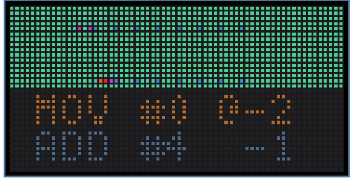

# Hack Club Neon YSWS Submissions #

Here's my submission for the Hack Club Neon YSWS

## Core War ##

An simple version of Core War implemented according to [this](https://corewar.co.uk/standards/cwg.txt) specification

The game loads two identical programs (see [dwarf.red](./dwarf.red)) that compete against each other

The map consists of 1024 green pixels originally, that eventually get populated by loaded instructions and data, the first program to execute data instead of a valid instruction loses

To run it in the Neon editor first paste the contents of [core_wars.py](./core_wars.py) into the neon editor, and then upload [5x7.bdf](./assets/5x7.bdf)

### Example ###

## XKCD Thumbnails ##

Fetches images from the [xkcd webcomic](https://xkcd.com/) and displays them. Unfortunately this looks really bad with all the gaps in between pixels so I haven't done much more with it
